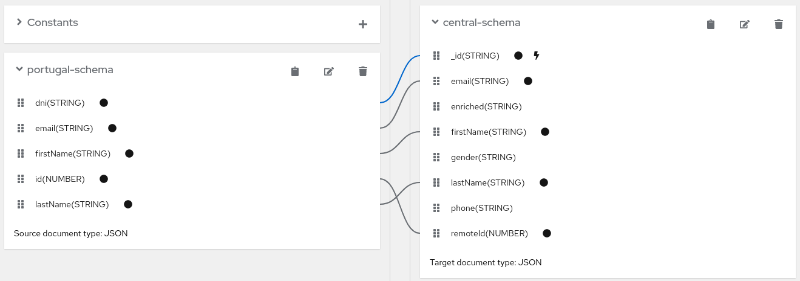

# Camel Quarkus and Debezium

This project uses Quarkus, the Supersonic Subatomic Java Framework. If you want to learn more about Quarkus, please visit its website: https://quarkus.io .

The microservice is implemented using [Red Hat build of Apache Camel for Quarkus](https://access.redhat.com/documentation/en-us/red_hat_build_of_apache_camel/4.0/html-single/release_notes_for_red_hat_build_of_apache_camel_for_quarkus/index) and [Camel 4.0.0](https://camel.apache.org/releases/release-4.0.0).

## Scenario


Process flow:

1. The microservice consumes _Debezium_ generated events from a Kafka topic
   + Events are extracted from a remote SQL database by a Debezium KafkaConnector already deployed and running. Debezium serializes the events using [AVRO](https://avro.apache.org/), publishes the event schema files into the [Apicurio Registry](https://www.apicur.io/registry/) and send the events into a Kafka topic.
   + The **Camel Kafka** component consumes the events from the topic, and uses the schemas retrieved from the Apicurio Registry to deserialize them from AVRO to JSON.

2. The microservice maps the consumed JSON event into a target canonical JSON by using [JSLT](https://github.com/schibsted/jslt). Then the canonical JSON information is moved to a POJO/entity class.
   + The microservice configuration defines which mapper is used.
   + There are two mappers included in the project, for two different source JSON schemas (`france` and `portugal`):
     + france-to-central-mapping.jslt
     + portugal-to-central-mapping.jslt
   
     Both of them map the values to the same target JSON schema (the `canonical` JSON schema).
   
   + The mapping also applies some basic transformations (trimming spaces and it changes a field to uppercase).

    Example: mapping records from the SQL _France_ table into the canonical JSON schema:

    

    Example: mapping records from the SQL _Portugal_ table into the canonical JSON schema:

    


3. It enriches the POJO with additional data (just adding the last time the document was updated).

4. Depending on the debezium event type:
   
   + It creates/inserts a new document into a MongoDB collection persisting the POJO.
   + It updates the previous existing document in MongoDB
   + It deletes the document in MongoDB


## Running the application in dev mode

You can run your application in dev mode that enables live coding using:
```shell script
./mvnw compile quarkus:dev
```

> **_NOTE:_**  Quarkus now ships with a Dev UI, which is available in dev mode only at http://localhost:8080/q/dev/.

## Packaging and running the application

From now on, everything has been tested with Java Open-JDK 21. Ensure you are using that version by setting your `JAVA_HOME` env-var with the proper directory location.

In my installation:

```shell script
export JAVA_HOME=/etc/alternatives/java_sdk_21_openjdk/
```

The application can be packaged using:
```shell script
./mvnw clean package
```
It produces the `quarkus-run.jar` file in the `target/quarkus-app/` directory.
Be aware that it’s not an _über-jar_ as the dependencies are copied into the `target/quarkus-app/lib/` directory.

Then, you can run the application by using `java -jar target/quarkus-app/quarkus-run.jar`. Before running it locally, **you must define** the required environment variables, URLs, etc., in order to make it work.

If you want to build an _über-jar_, execute the following command:
```shell script
./mvnw clean package -Dquarkus.package.type=uber-jar
```

The application, packaged as an _über-jar_, is now runnable using `java -jar target/*-runner.jar`.

### Creating a native executable

You can create a native executable using: 
```shell script
./mvnw clean package -Dnative
```

Or, if you don't have GraalVM installed, you can run the native executable build in a container using: 
```shell script
./mvnw clean package -Dnative -Dquarkus.native.container-build=true
```

Then you can execute your native executable with: `./target/code-with-quarkus-2.0.0-SNAPSHOT-runner`

If you want to learn more about building native executables, please consult https://quarkus.io/guides/maven-tooling.


## Building Application Image

This microservice is already built (both native and non-native) and the images are available here:

* ```quay.io/ryanezil/camel-quarkus-dbz:2.0.0-SNAPSHOT```.
* ```quay.io/ryanezil/camel-quarkus-dbz-native:2.0.0-SNAPSHOT```.

### How to build - Non-native image

1. Package application

   ```bash
   # Ensure you are using java-21
   # export JAVA_HOME=/etc/alternatives/java_sdk_21_openjdk/

   ./mvnw clean package
```

2. Build container image

   Remember to tag the result image with your desired target repository.

   ```bash
   podman build -f src/main/docker/Dockerfile.jvm -t quay.io/ryanezil/camel-quarkus-dbz:2.0.0-SNAPSHOT .
   ```

3. Upload to image registry

   ```bash
   podman push quay.io/ryanezil/camel-quarkus-dbz:2.0.0-SNAPSHOT
   ```


### How to build - Native image


1. Package application

   ```bash
   # Ensure you are using java-21
   # export JAVA_HOME=/etc/alternatives/java_sdk_21_openjdk/

   ./mvnw clean package -Dnative -Dquarkus.native.container-build=true
   ```

2. Build container image

   Remember to tag the result image with your desired target repository.

   ```bash
   podman build -f src/main/docker/Dockerfile.native-micro -t quay.io/ryanezil/camel-quarkus-dbz-native:2.0.0-SNAPSHOT .
   ```

3. Upload to image registry

   ```bash
   podman push quay.io/ryanezil/camel-quarkus-dbz-native:2.0.0-SNAPSHOT
   ```

## Prepare OpenShift environment

In order to deploy this Quarkus-Camel4 microservice, you need the following components already configured and running:

* MariaDB
* MongoDB
* AMQ Streams:
  * Kafka
  * kafka Connect
    * MySql Debezium connector
* Apicurio Service Registry

In the [OpenShift](./openshift) directory a set of scripts are included in order to ease the deployment. You can run all of them following the sequence number:

* 00-deploy-mariadb.sh
* 10-deploy-amq-streams.sh
* 20-deploy-mongodb-sh
* 30-deploy-service-registry.sh
* 40-deploy-mysql-debezium-connector.sh


## Deploying the microservice on OpenShift

1. Create a target namespace

   ```bash
   oc new-project camel-integration
   ```

2. Create secret from env-vars file

   ```bash
   oc create secret generic camel-quarkus-dbz-configuration --from-env-file=k8s/configuration.env
   ```

3. Create configmap containing all JSTL mappers

   Mappers are externalized in order to be accessible by native and non-native images.

   Change the source path `src/main/resources/` as needed depending on where you are running the following command:

   ```bash
   oc create configmap jslt-mappers-cm --from-file=src/main/resources/jslt-mappers/
   ```

4. Deploy application

   **Non native** deployment:

   Deploy the non-native image from the image registry:

   ```bash
   oc apply -f k8s/deployment.yaml
   ```

   **Native** deployment:

   Deploy the native image from the image registry:

   ```bash
   oc apply -f k8s/deployment-native.yaml
   ```
